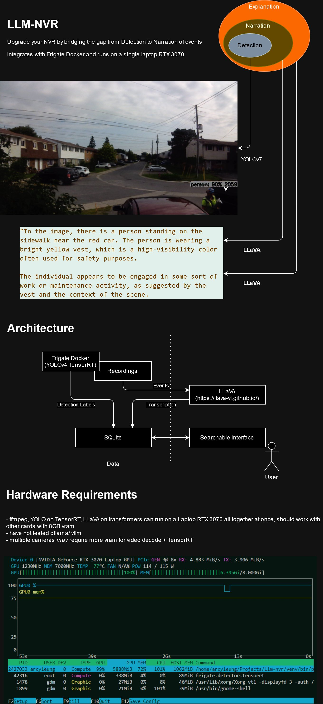

# LLM-NVR

This project is a proof of concept for using multi-modal LLMs to integrate with NVRs and perform narration, explanation on top of object detection and tracking.

## Setup

1. Install python3 and activate the venv: `python3 -m venv venv`
2. Install requirements: `pip install -r requirements.txt`
3. Edit configs in frigate/ subdirectory and bring up Frigate with docker compose: `cd frigate && docker-compose up -d frigate nvr`
4. Run docker compose to bring the frontend and backend up: `docker-compose up -d`
5. Run the jupyter notebook in analyze.ipynb

## Demo
[Link](https://x.com/arcyleung/status/1835194959290327250)

## Architecture
